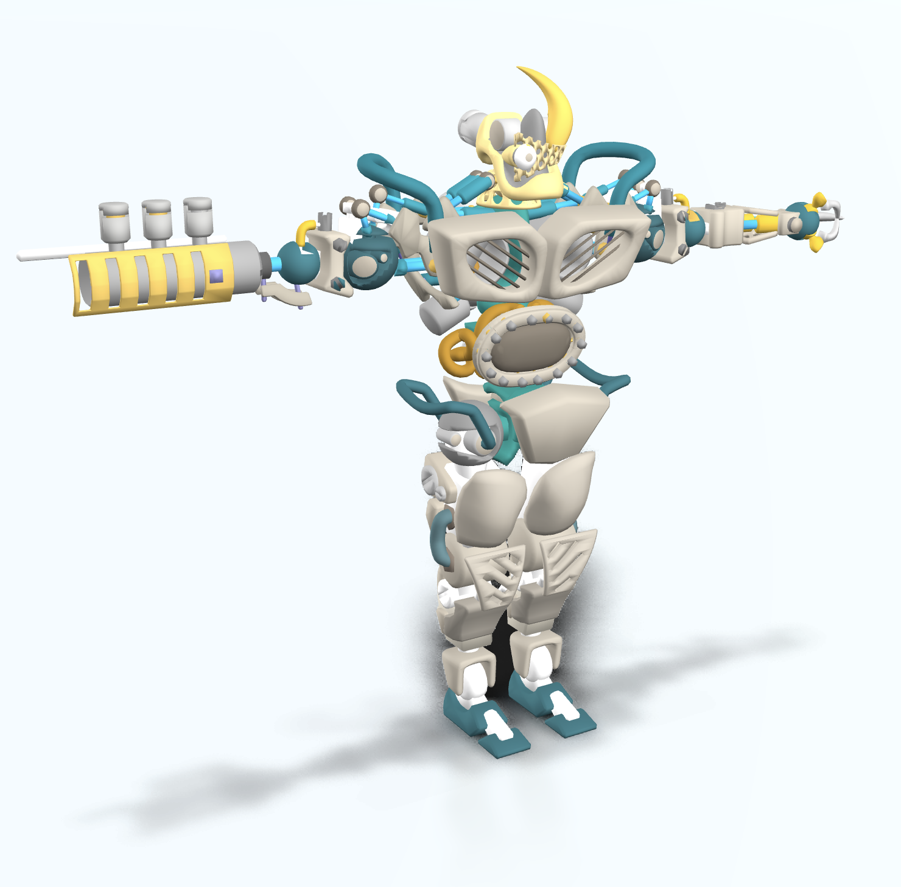

# Three.js GLB/GLTF viewer

**[GLB/GLTF viewer](https://rabbid76.github.io/threejs-gltf-glb-viewer/deploy/)**

Examples from [KhronosGroup/glTF-Sample-Models](https://github.com/KhronosGroup/glTF-Sample-Models)

  
  
  

## Install and build

```lang-none
npm run install:webpack
npm i  
npm run build
npm run dev
```

## Resources

### Three.js examples

- [https://threejs.org/examples/](https://threejs.org/examples/)

### Postprocessing and Realism Effects

- [GitHub - Post Processing](https://github.com/pmndrs/postprocessing#post-processing)
- [GitHub - three.js Realism Effects](https://github.com/0beqz/realism-effects)
- [Realism Effects AO example](https://realism-effects.vercel.app/?ao)

### Three.js color management

- [Color management](https://threejs.org/docs/#manual/en/introduction/Color-management)
- [Updates to Color Management in three.js r152](https://discourse.threejs.org/t/updates-to-color-management-in-three-js-r152/50791)

### Three.js Shadow

- [https://sbcode.net/threejs/directional-light-shadow/](https://sbcode.net/threejs/directional-light-shadow/)
- [https://sbcode.net/threejs/soft-shadows/](https://sbcode.net/threejs/soft-shadows/)
- [https://cs.wellesley.edu/~cs307/lectures/20new.html](https://cs.wellesley.edu/~cs307/lectures/20new.html)
- [https://discourse.threejs.org/t/performant-soft-shadows-three-js/27777](https://discourse.threejs.org/t/performant-soft-shadows-three-js/27777)
- [https://codesandbox.io/s/soft-shadows-dh2jc?file=/src/index.js:143-154](https://codesandbox.io/s/soft-shadows-dh2jc?file=/src/index.js:143-154)

#### Three.js basic shadow map

- [https://threejs.org/examples/?q=shadow#webgl_shadowmap_pointlight](https://threejs.org/examples/?q=shadow#webgl_shadowmap_pointlight)
- [https://threejs.org/examples/?q=shadow#webgl_shadowmap_viewer](https://threejs.org/examples/?q=shadow#webgl_shadowmap_viewer)
- [https://threejs.org/examples/webgl_shadowmesh.html](https://threejs.org/examples/webgl_shadowmesh.html)

#### Three.js PCF (soft) shadow map

- [https://threejs.org/examples/webgl_shadowmap.html](https://threejs.org/examples/webgl_shadowmap.html)
- [https://threejs.org/examples/webgl_shadowmap_performance.html](https://threejs.org/examples/webgl_shadowmap_performance.html)

#### Three.js Cascaded shadow mapping (CSM)

- [https://threejs.org/examples/webgl_shadowmap_csm.html](https://threejs.org/examples/webgl_shadowmap_csm.html)

#### Three.js VSM shadow map

- [https://threejs.org/examples/webgl_shadowmap_vsm.html](https://threejs.org/examples/webgl_shadowmap_vsm.html)

#### Three.js PCSS shadow

- [https://threejs.org/examples/?q=shado#webgl_shadowmap_pcss](https://threejs.org/examples/?q=shado#webgl_shadowmap_pcss)

### Three-js postprocessing

[How to use post-processing](https://threejs.org/docs/#manual/en/introduction/How-to-use-post-processing)

#### Progressive Light map

- [https://threejs.org/examples/webgl_shadowmap_progressive.html](https://threejs.org/examples/webgl_shadowmap_progressive.html)
- [https://codesandbox.io/s/adaptive-lightmaps-wsg13?file=/src/Lightmap.js:251-270](https://codesandbox.io/s/adaptive-lightmaps-wsg13?file=/src/Lightmap.js:251-270)

#### Three.js contact shadow

- [https://threejs.org/examples/webgl_shadow_contact.html](https://threejs.org/examples/webgl_shadow_contact.html)
- [https://codesandbox.io/s/shoe-configurator-qxjoj?file=/src/App.js](https://codesandbox.io/s/shoe-configurator-qxjoj?file=/src/App.js)

#### Static light map

- [https://threejs.org/examples/webgl_materials_lightmap.html](https://threejs.org/examples/webgl_materials_lightmap.html)

#### Ambient Occlusion

- [https://gkjohnson.github.io/threejs-sandbox/gtaoPass/](https://gkjohnson.github.io/threejs-sandbox/gtaoPass/)

#### Three.js SSAOPass

- [https://threejs.org/examples/webgl_postprocessing_ssao.html](https://threejs.org/examples/webgl_postprocessing_ssao.html)
- [https://alteredqualia.com/three/examples/webgl_postprocessing_ssao.html](https://alteredqualia.com/three/examples/webgl_postprocessing_ssao.html)

#### Three.js SAOPass

- [https://threejs.org/examples/webgl_postprocessing_sao.html](https://threejs.org/examples/webgl_postprocessing_sao.html)

#### Environment

- [https://threejs.org/docs/#api/en/extras/PMREMGenerator](https://threejs.org/docs/#api/en/extras/PMREMGenerator)

#### Global illumination

- [Adopting a Progressive Photorealistic Global Illumination in Three.JS](https://github.com/mrdoob/three.js/issues/14051)  
- [https://threejs.org/examples/webgl_simple_gi.html](https://threejs.org/examples/webgl_simple_gi.html)

#### Screen space reflection

- [https://threejs.org/examples/webgl_postprocessing_ssr.html](https://threejs.org/examples/webgl_postprocessing_ssr.html)
- [https://github.com/0beqz/screen-space-reflections](https://github.com/0beqz/screen-space-reflections)
- [npm - three.js Screen Space Reflections](https://www.npmjs.com/package/screen-space-reflections)  
- [https://screen-space-reflections.vercel.app/](https://screen-space-reflections.vercel.app/)
- [Three.js Screen Space Reflections](https://reactjsexample.com/three-js-screen-space-reflections/)  

#### Outline

- [https://threejs.org/examples/webgl_postprocessing_outline.html](https://threejs.org/examples/webgl_postprocessing_outline.html)

#### Bloom

- [https://threejs.org/examples/webgl_postprocessing_unreal_bloom.html](https://threejs.org/examples/webgl_postprocessing_unreal_bloom.html)
- [https://threejs.org/examples/webgl_postprocessing_unreal_bloom_selective.html](https://threejs.org/examples/webgl_postprocessing_unreal_bloom_selective.html)
- [https://github.com/mattatz/THREE.BloomBlendPass](https://github.com/mattatz/THREE.BloomBlendPass)

### Specifications

- [WebGL Specification](https://registry.khronos.org/webgl/specs/latest/1.0/)
- [OpenGL ES 2.0 Common Profile Specification](https://registry.khronos.org/OpenGL/specs/es/2.0/es_full_spec_2.0.pdf)
- [OpenGL ES Shading Language 1.00 Specification](https://registry.khronos.org/OpenGL/specs/es/2.0/GLSL_ES_Specification_1.00.pdf)
- [WebGL 2.0 Specification](https://registry.khronos.org/webgl/specs/latest/2.0/)
- [OpenGL ES 3.0.6 Specification](https://registry.khronos.org/OpenGL/specs/es/3.0/es_spec_3.0.pdf)
- [OpenGL ES Shading Language 3.00 Specification](https://registry.khronos.org/OpenGL/specs/es/3.0/GLSL_ES_Specification_3.00.pdf)

### Shader

- [Line texture](https://www.shadertoy.com/view/NsjczG)
- [GRAPROG](https://www.shadertoy.com/view/MdBcz1)
- [Vorocracks marble](https://www.shadertoy.com/view/Xs3fR4)
- [Kraft](https://www.shadertoy.com/view/4lKyDm)
- [Grid Paper](https://www.shadertoy.com/view/4tj3DG)
- [Cube Circle Sketch](https://www.shadertoy.com/view/3dtBWX)